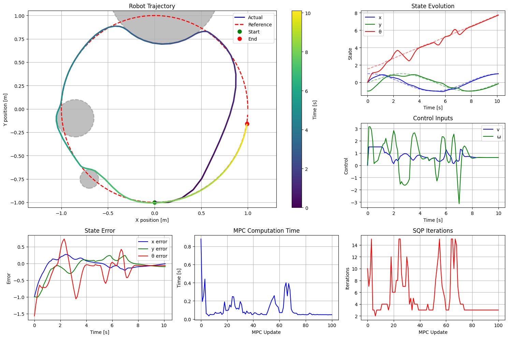

# MPC-based Unicycle Trajectory Tracking with Control Barrier Functions (CBFs)
## Overview
This repository contains an example that implements a Model Predictive Control (MPC) controller for trajectory tracking of a unicycle while enforcing safety constraints using Control Barrier Functions (CBFs). The goal is to follow a predefined reference trajectory while avoiding an obstacle and staying within a safe region.

There have been many repositories with similar implementations, but most of them are using CasADi or MATLAB. This repository is a Python implementation that uses CVXPY for the QP subproblem and jax for autograd as well as parallelization.

## Requirements
- Python 3.10+
- `jax`
- `cvxpy`
- `numpy`
- `matplotlib`

## Demo
To run the demo, simply run the `sqp_mpccbf_tracking.ipynb` notebook in Google Colab .

## Key Features of the MPC + CBF Implementation
- Trajectory tracking with real-time MPC using linearized dynamics.
- Control Barrier Functions (CBFs) to enforce  `x - y + 1.2 >= 0` (visualized as a wall at upper left)
- Sequential Quadratic Programming (SQP) for handling nonlinearities and updating the linearization at each iteration.
- QP formulation using cvxpy with cp.Parameter for warm-starting and fast updates.

## Trouble Shooting
- OSQP failed: remove `time_limit` argument in `prob.solve(...)` or increase `max_sqp_iter` or try different QP solvers.

